# 🤖 GitHub Copilot: การพัฒนา Software แบบ End-to-End

> ## ระบบให้คะแนนมวยไทยด้วย Untitled UI
> ### จากการเก็บ Requirements ถึงการส่งมอบด้วย AI

---

## 📋 สารบัญ

1. [🎯 ภาพรวม Workshop](#ภาพรวม-workshop)
2. [🔄 กระบวนการพัฒนา 4 ขั้นตอน](#กระบวนการพัฒนา-4-ขั้นตอน)
3. [📝 Step 1: Requirements ด้วย V-Model](#step-1-requirements-ด้วย-v-model)
4. [📐 Step 2: Documentation & Architecture](#step-2-documentation--architecture)
5. [👨‍💻 Step 3: Task Creation & Standards](#step-3-task-creation--standards)
6. [🤖 Step 4: Copilot Instructions](#step-4-copilot-instructions)
7. [🚀 Implementation Journey](#implementation-journey)
8. [📊 Testing ด้วย V-Model](#testing-ด้วย-v-model)
9. [💡 Best Practices & Advanced Techniques](#best-practices--advanced-techniques)
10. [🎯 Live Demo & Hands-On](#live-demo--hands-on)

---

## 🎯 ภาพรวม Workshop

### สิ่งที่เราจะสร้างวันนี้

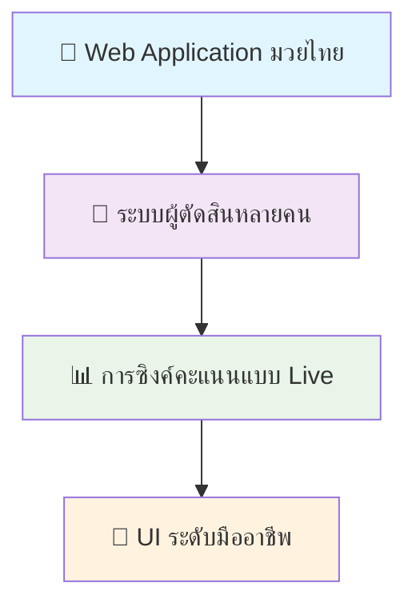

### Tech Stack ที่ใช้

| Layer | Technology | Purpose |
|-------|------------|---------|
| 🎨 **Frontend** | Next.js 15 + TypeScript | Modern React framework |
| 🎨 **UI System** | Untitled UI Design System | Professional components |
| ⚡ **Backend** | FastAPI + PostgreSQL | High-performance API |
| 🔄 **Real-time** | WebSocket | Live score sync |
| 🤖 **AI Assistant** | GitHub Copilot | Development acceleration |

---

## 🔄 กระบวนการพัฒนา 4 ขั้นตอน

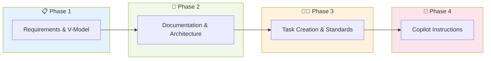

### การพัฒนาด้วย AI

| ขั้นตอน | เวลาแบบดั้งเดิม | เวลาใช้ Copilot | ประหยัดได้ |
|---------|----------------|------------------|------------|
| 📋 Requirements | 2 วัน | 4 ชั่วโมง | **75%** |
| 📐 Documentation | 3 วัน | 6 ชั่วโมง | **75%** |
| 👨‍💻 API Development | 5 วัน | 1.5 วัน | **70%** |
| 🎨 UI Development | 4 วัน | 1 วัน | **75%** |
| ✅ Testing | 3 วัน | 1 วัน | **67%** |
| **🎯 รวม** | **17 วัน** | **4 วัน** | **76%** |

---

## 📝 Step 1: Requirements ด้วย V-Model

### 🌟 จุดเริ่มต้น

**Requirement เริ่มต้น:**
> "ผู้ตัดสินสามารถให้คะแนนการชกแบบ real-time ได้"

### 🤖 การขยาย Requirements ด้วย Copilot

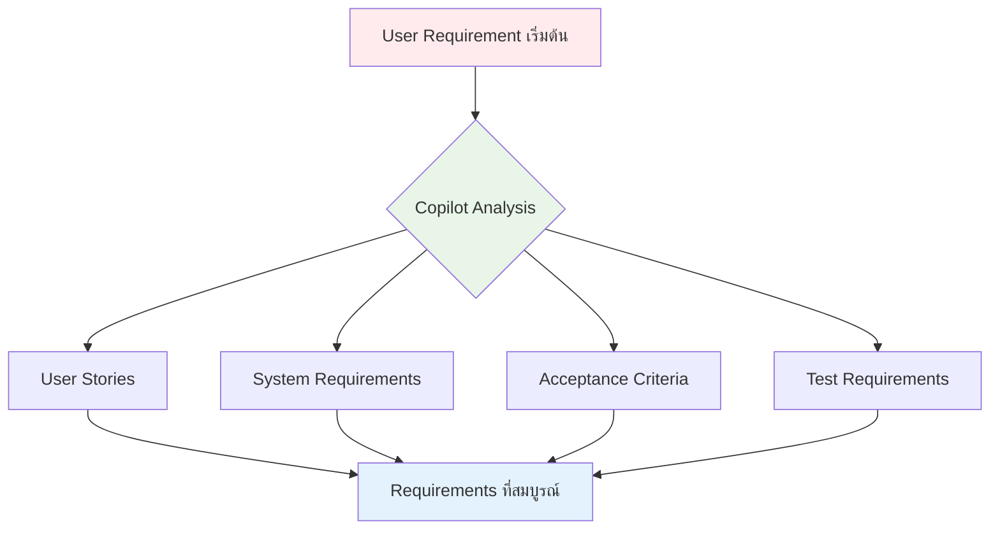

### 📊 แนวทาง V-Model

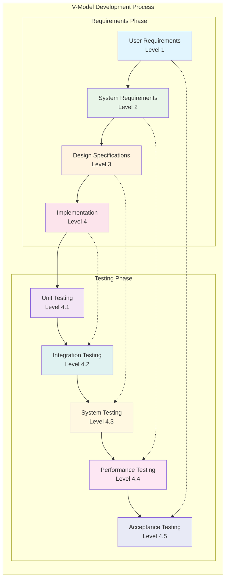

### ✅ ประโยชน์ของ V-Model

- ✅ **ไม่มีอะไรหลุดลอย** - ครอบคลุมทุกมุมมอง
- ✅ **เกณฑ์การ Test ชัดเจน** - มี traceability ที่สมบูรณ์
- ✅ **Requirements ที่ Trace ได้** - เชื่อมโยงจาก User ถึง Test

---

## 📐 Step 2: Documentation & Architecture

### 📁 โครงสร้างเอกสารที่ Copilot สร้าง

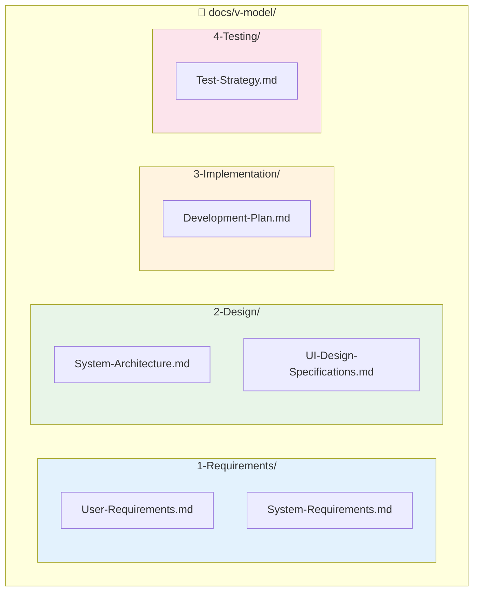

### 🏗️ System Architecture

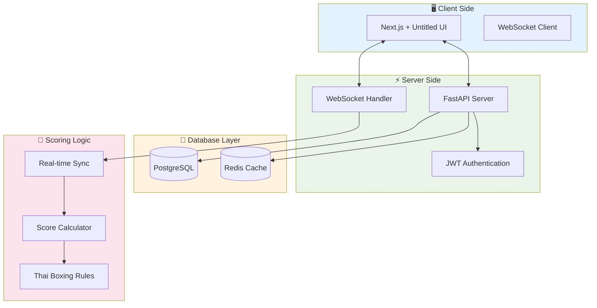

### 🎯 คุณสมบัติหลักของระบบ

| Feature | Description | Technology |
|---------|-------------|------------|
| 👥 **Multi-Judge** | รองรับผู้ตัดสินหลายคน | WebSocket + State Management |
| ⚡ **Real-time Sync** | การซิงค์แบบ live < 100ms | Socket.io + Redis |
| 🔐 **Role Management** | การจัดการสิทธิ์ตามบทบาท | JWT + Role-based Access |
| 📊 **Score Validation** | การตรวจสอบคะแนนอัตโนมัติ | Business Logic Layer |

---

## 👨‍💻 Step 3: Task Creation & Standards

### 📋 การแบ่ง Tasks ตามทีม

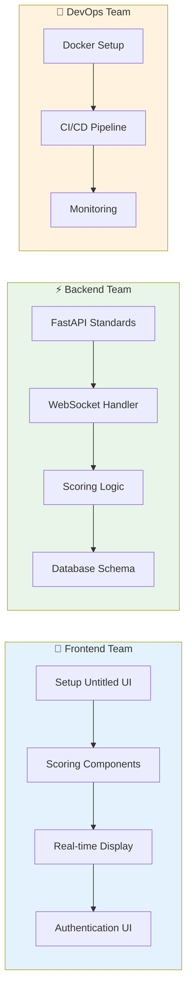

### 🎨 มาตรฐาน Design System

#### Color Scheme สำหรับมวยไทย

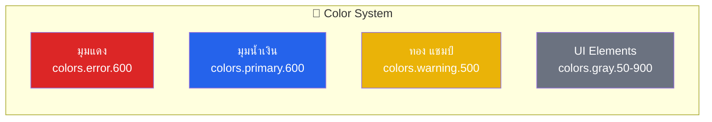

#### Component Standards

| Component Type | Standard | Example |
|----------------|----------|---------|
| 🎯 **Buttons** | Untitled UI variants only | `variant="primary"`, `size="lg"` |
| 📝 **Forms** | Validation + Error states | `<FormField error={...} required />` |
| 📊 **Charts** | Chart.js + consistent colors | Thai boxing color scheme |
| 🔔 **Notifications** | Toast system | Real-time score updates |

### ⚡ มาตรฐาน API

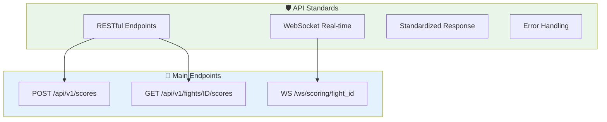

#### Response Format Standard

```typescript
// 📋 Standard API Response
{
  "success": true,
  "data": {
    "fight_id": "123",
    "round": 1,
    "scores": {
      "red_corner": 10,
      "blue_corner": 9
    }
  },
  "message": "ส่งคะแนนเรียบร้อย",
  "timestamp": "2025-07-08T10:00:00Z"
}
```

---

## 🤖 Step 4: Copilot Instructions

### 📋 การควบคุม Project ด้วย `.github/copilot-instructions.md`

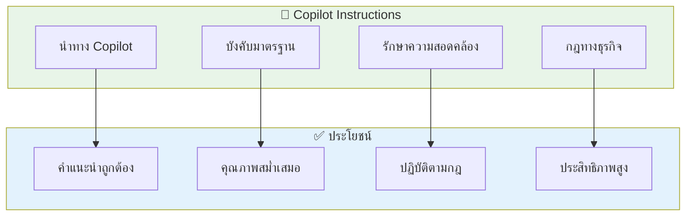

### 🥊 กฎทางธุรกิจในการให้คะแนนมวยไทย

#### การให้คะแนน

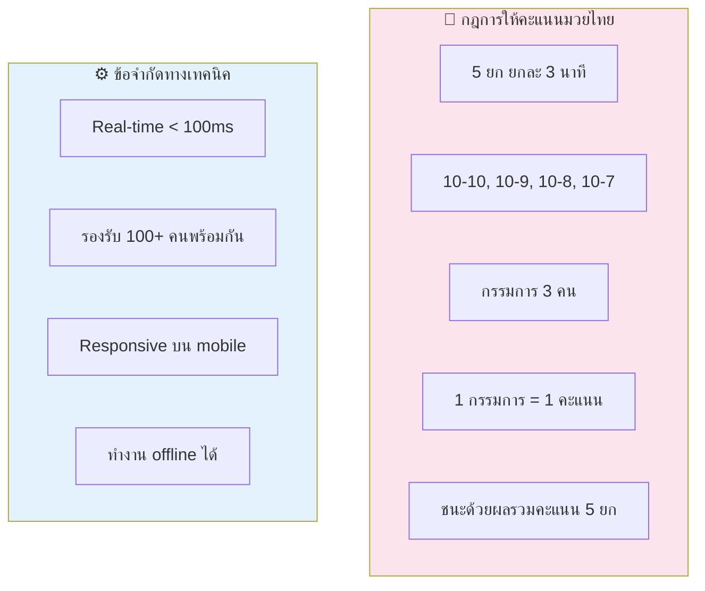

#### Business Logic Implementation

| Rule | Implementation | Validation |
|------|---------------|------------|
| 🥊 **5 ยก 3 นาที** | Timer component + round tracking | Auto round progression |
| 📊 **Scoring 10-10 to 10-7** | Dropdown with valid options only | Input validation |
| 👥 **กรรมการ 3 คน** | Role-based access control | Authentication check |
| 🏆 **ผลรวมคะแนน 5 ยก** | Sum calculation per judge | Total score validation |
| ⚡ **< 100ms sync** | WebSocket optimization | Performance monitoring |

### 🏆 วิธีการตัดสินชนะ-แพ้

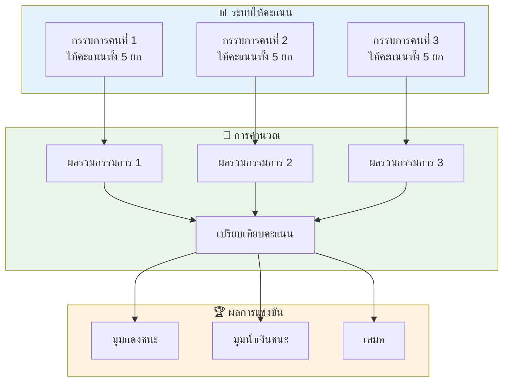

**🎯 ตัวอย่างการให้คะแนน:**

| กรรมการ | ยก 1 | ยก 2 | ยก 3 | ยก 4 | ยก 5 | รวม | ผู้ชนะ |
|---------|------|------|------|------|------|-----|--------|
| **กรรมการ 1** | 10-9 | 9-10 | 10-9 | 10-9 | 10-9 | **49-47** | มุมแดง |
| **กรรมการ 2** | 10-9 | 10-9 | 9-10 | 10-9 | 10-9 | **49-47** | มุมแดง |
| **กรรมการ 3** | 9-10 | 10-9 | 10-9 | 9-10 | 10-9 | **48-48** | เสมอ |

**📊 ผลการตัดสิน:** มุมแดงชนะด้วยคะแนน 2-0 (1 เสมอ)

---

## 🚀 Implementation Journey

### 🔐 1. Authentication System

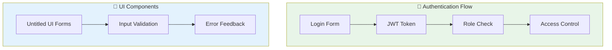

### 🥊 2. Scoring Interface

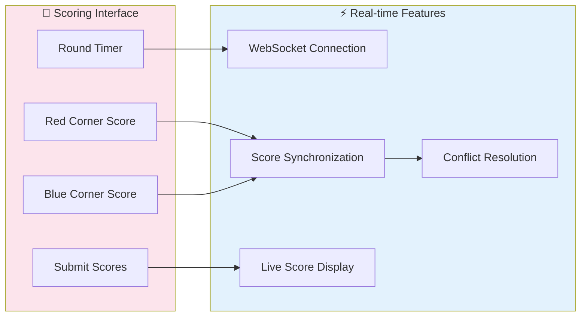

### 📊 3. Live Scoreboard

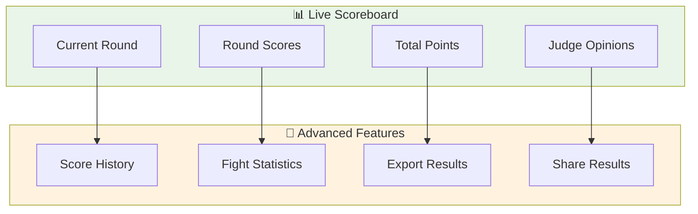

---

## 📊 Testing ด้วย V-Model

### 🧪 ระดับการทดสอบ

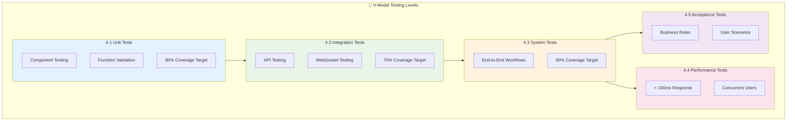

### 📈 Quality Gates

| Test Level | Coverage | Success Rate | Performance |
|------------|----------|--------------|-------------|
| 🧪 **Unit** | 80% | 0% failure | < 50ms |
| 🔗 **Integration** | 70% | < 5% failure | < 100ms |
| 🌐 **System** | 60% | < 10% failure | < 5s |
| ⚡ **Performance** | N/A | API < 100ms | DB < 50ms |
| ✅ **Acceptance** | 95% | < 2% failure | User scenarios |

---

## 💡 Best Practices & Advanced Techniques

### ✅ ควรทำ (Best Practices)

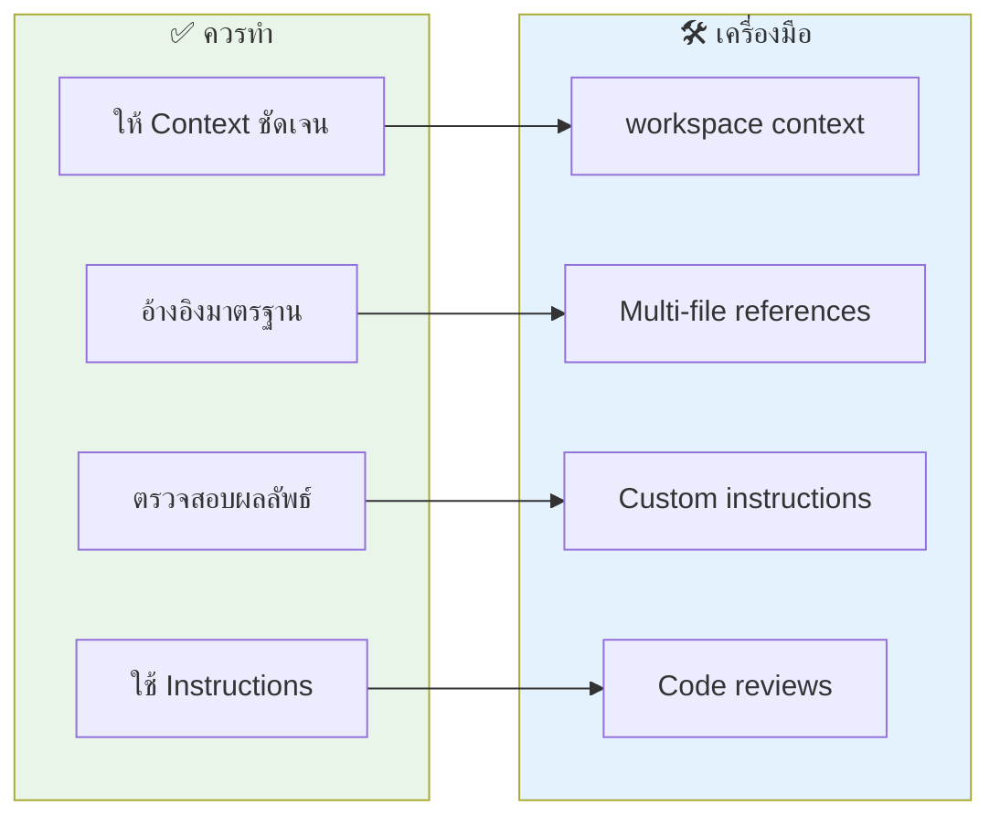

### ❌ ไม่ควรทำ (Anti-Patterns)

| ❌ Don't | ✅ Do Instead | เหตุผล |
|----------|---------------|---------|
| ยอมรับโดยไม่ตรวจสอบ | Review และ validate | คุณภาพ code |
| ข้าม validation | ทำ testing ทุกครั้ง | ป้องกัน bugs |
| ละเลยมาตรฐาน | ปฏิบัติตาม standards | Consistency |
| ลืมกฎทางธุรกิจ | รวมใน instructions | Business logic |

### 🚀 เทคนิคขั้นสูง

#### Multi-file Context

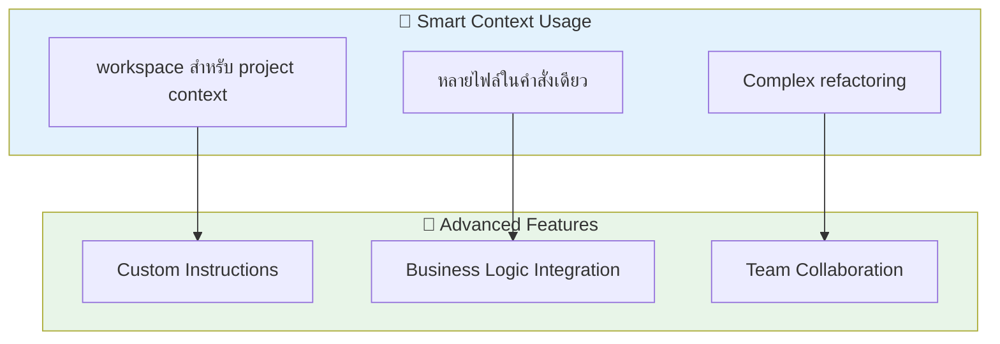

---

## 🎯 Live Demo & Hands-On

### 🛠️ Workshop Activities

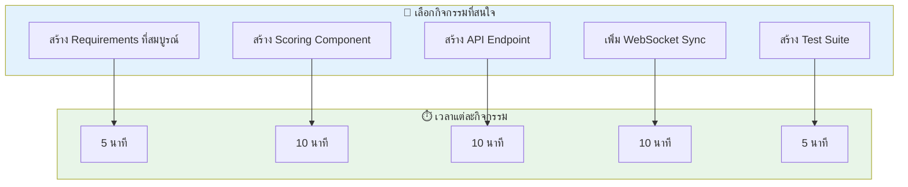

### 📝 Live Coding Workflow

1. **📋 Requirements (5 นาที)**
   - ใช้ Copilot ขยาย requirement เริ่มต้น
   - สร้าง user stories และ acceptance criteria

2. **⚡ API Endpoint (10 นาที)**
   - FastAPI พร้อมรูปแบบ response มาตรฐาน
   - การ validation และ error handling

3. **🎨 UI Component (10 นาที)**
   - Untitled UI scoring panel
   - Real-time state management

4. **🔄 Real-time Sync (10 นาที)**
   - WebSocket implementation
   - Live score synchronization

5. **🧪 Tests (5 นาที)**
   - V-Model test structure
   - Automated test generation

---

## 🎉 สรุปและ Q&A

### 🏆 ข้อสรุปสำคัญ

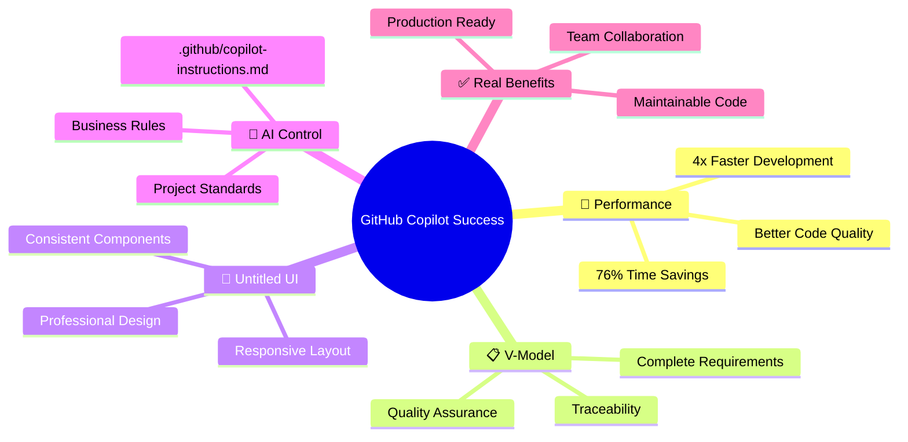

### 💬 Questions & Discussion

**🤔 คำถามที่พบบ่อย:**

1. **Q: Copilot ช่วยได้จริงหรือเปล่า?**
   - A: ประหยัดเวลา 76% ในโปรเจ็คจริง ✅

2. **Q: V-Model ซับซ้อนเกินไปไหม?**
   - A: Copilot ช่วยสร้างอัตโนมัติ ไม่ซับซ้อน ✅

3. **Q: Untitled UI ใช้ยากไหม?**
   - A: มี standards ชัดเจน ใช้งานง่าย ✅

4. **Q: .github/copilot-instructions.md จำเป็นไหม?**
   - A: จำเป็นมาก! ควบคุมคุณภาพ code ✅

---

### 🎯 Next Steps

1. **📚 เรียนรู้เพิ่มเติม**
   - ศึกษา Untitled UI documentation
   - ลองใช้ V-Model ในโปรเจ็คจริง
   - สร้าง copilot-instructions.md

2. **🛠️ ลงมือทำ**
   - เริ่มต้นด้วยโปรเจ็คเล็กๆ
   - ใช้ Copilot ในงานประจำ
   - สร้างมาตรฐานทีม

3. **🤝 แชร์ประสบการณ์**
   - แบ่งปันกับทีม
   - สร้าง best practices
   - ช่วยกันพัฒนา

---

## 📚 Resources & Links

### 🔗 เอกสารอ้างอิง

- [GitHub Copilot Documentation](https://docs.github.com/en/copilot)
- [Untitled UI Design System](https://untitledui.com/)
- [FastAPI Documentation](https://fastapi.tiangolo.com/)
- [V-Model Testing Methodology](https://en.wikipedia.org/wiki/V-Model)

### 🛠️ Tools & Templates

- [Copilot Instructions Template](https://github.com/github/copilot-instructions)
- [Untitled UI Components](https://github.com/untitledui/components)
- [V-Model Test Structure](https://github.com/v-model/testing)

---

> **🎯 สำคัญ:** การใช้ GitHub Copilot อย่างมีประสิทธิภาพต้องมีการเตรียมการที่ดี ทั้ง requirements, standards, และ instructions ที่ชัดเจน
> 
> **🚀 ผลลัพธ์:** ทีมที่ใช้ Copilot อย่างถูกต้องสามารถพัฒนา software ได้เร็วขึ้น 4 เท่า พร้อมคุณภาพที่สูงกว่า

**📅 Last Updated:** 8 กรกฎาคม 2568  
**👨‍💻 Created by:** Aragon Edge AI Development Team
