# 🎯 Checkout System Completion - Task Plan

**Date**: July 13, 2025  
**Status**: 🔄 **ACTIVE** - Implementation Phase  
**Priority**: 🔴 **CRITICAL** - Complete Essential Checkout Functionality  
**Deadline**: July 17, 2025 (3.5 days remaining)

---

## 📋 **TASK SUMMARY**

| Task | Status | Priority | Time | Files | Progress |
|------|--------|----------|------|-------|----------|
| **Task 1**: Scanner-Checkout Bridge | 🔄 In Progress | 🔴 Critical | 1 day | 3 files | 70% |
| **Task 2**: Real Device Integration | ⏳ Pending | 🔴 Critical | 1 day | 4 files | 60% |
| **Task 3**: Complete Workflow | ⏳ Pending | 🟠 High | 1 day | 5 files | 75% |
| **Task 4**: Testing & Validation | ⏳ Pending | � Medium | 0.5 days | 2 files | 30% |

**Overall Progress**: 85% → Target: 100%

---

## 🎯 **SYSTEM ARCHITECTURE OVERVIEW**

## 🎯 **SYSTEM ARCHITECTURE OVERVIEW**

### Current System Status (85% Complete)

```mermaid
graph TD
    subgraph "✅ COMPLETED MODULES (85%)"
        A[🎨 Frontend Dashboard<br/>100% Complete]
        B[🌐 Backend API<br/>90% Complete]
        C[💾 Database Models<br/>95% Complete]
        D[🔧 TCP Scanner Hook<br/>95% Complete]
    end
    
    subgraph "❌ MISSING INTEGRATION (15%)"
        E[🔗 Scanner Selection Panel<br/>❌ Missing]
        F[📡 Real-time Data Bridge<br/>❌ Missing]
        G[🔄 Complete Workflow<br/>❌ Missing]
        H[🧪 E2E Testing<br/>❌ Missing]
    end
    
    subgraph "🎯 TARGET SYSTEM"
        I[💯 Production-Ready<br/>Checkout System]
    end
    
    A --> E
    B --> F
    C --> G
    D --> E
    
    E --> I
    F --> I
    G --> I
    H --> I
    
    classDef completed fill:#c8e6c9,stroke:#4caf50,stroke-width:3px
    classDef missing fill:#ffcdd2,stroke:#f44336,stroke-width:3px
    classDef target fill:#e3f2fd,stroke:#2196f3,stroke-width:4px
    
    class A,B,C,D completed
    class E,F,G,H missing
    class I target
```


### Target Workflow Architecture

```mermaid
sequenceDiagram
    participant U as 👤 User
    participant D as 🎨 Dashboard
    participant S as 📡 Scanner
    participant A as 🌐 API
    participant DB as 💾 Database

    Note over U,DB: 🎯 TARGET COMPLETE WORKFLOW
    
    U->>D: 1. Open /checkout
    D->>S: 2. Discover Scanners
    S-->>D: 3. Scanner List
    
    U->>D: 4. Select Scanner
    D->>A: 5. Create Session + Scanner
    A->>DB: 6. Save Session
    
    U->>D: 7. Start Scanning
    D->>S: 8. Connect TCP Scanner
    S-->>D: 9. Real-time Scans
    D->>A: 10. Process Scans
    A->>DB: 11. Save Items
    
    U->>D: 12. Complete Session
    D->>A: 13. Finalize
    A->>DB: 14. Mark Complete
```


---

## � **DETAILED TASK BREAKDOWN**

## 📋 **DETAILED TASK BREAKDOWN**

### 🔗 **TASK 1: Scanner-Checkout Integration Bridge**

```mermaid
graph LR
    subgraph "TASK 1 COMPONENTS"
        A[📱 ScannerSelectionPanel<br/>Component]
        B[🔌 useTCPScanner<br/>Integration]
        C[⚡ Real-time Events<br/>Bridge]
    end
    
    subgraph "INPUT"
        D[🔧 TCP Scanner Hook<br/>✅ EXISTS]
        E[🎨 Checkout Dashboard<br/>✅ EXISTS]
    end
    
    subgraph "OUTPUT"
        F[🎯 Scanner Selection<br/>in Checkout]
    end
    
    D --> A
    E --> A
    A --> B
    B --> C
    C --> F
    
    classDef task fill:#fff3e0,stroke:#ff9800,stroke-width:3px
    classDef exists fill:#e8f5e8,stroke:#4caf50,stroke-width:2px
    classDef target fill:#e3f2fd,stroke:#2196f3,stroke-width:3px
    
    class A,B,C task
    class D,E exists
    class F target
```


**Status**: 🔄 In Progress (70% Complete)  
**Priority**: 🔴 CRITICAL  
**Time Estimate**: 1 day  
**Blocker**: Scanner selection not integrated with checkout dashboard

#### **Files to Create/Modify**:
```typescript
// ✅ CREATE NEW
frontend/src/components/checkout/ScannerSelectionPanel.tsx

// 🔧 MODIFY EXISTING  
frontend/src/app/checkout/page.tsx
frontend/src/components/checkout/RealtimeScanningDisplay.tsx
```

#### **Task 1 Success Criteria**:
- [ ] User sees available scanners in checkout dashboard
- [ ] User can select scanner and create session
- [ ] Scanner connection status displays in real-time

---

### � **TASK 2: Real Device Data Integration**

```mermaid
graph LR
    subgraph "TASK 2 COMPONENTS"
        A[🌐 WebSocket<br/>Integration]
        B[📊 Real Data<br/>Display]
        C[🔄 Event<br/>Processing]
    end
    
    subgraph "INPUT"
        D[📡 Scanner Test Interface<br/>✅ EXISTS]
        E[🎭 Mock Data Display<br/>✅ EXISTS]
    end
    
    subgraph "OUTPUT"
        F[📱 Live Scanner Data<br/>in Checkout]
    end
    
    D --> A
    E --> B
    A --> C
    B --> C
    C --> F
    
    classDef task fill:#fff3e0,stroke:#ff9800,stroke-width:3px
    classDef exists fill:#e8f5e8,stroke:#4caf50,stroke-width:2px
    classDef target fill:#e3f2fd,stroke:#2196f3,stroke-width:3px
    
    class A,B,C task
    class D,E exists
    class F target
```


**Status**: ⏳ Pending (60% Complete)  
**Priority**: 🔴 CRITICAL  
**Time Estimate**: 1 day  
**Blocker**: WebSocket not connected to checkout dashboard

#### **Files to Create/Modify**:
```typescript
// ✅ CREATE NEW
frontend/src/hooks/useCheckoutWebSocket.ts

// 🔧 MODIFY EXISTING
frontend/src/app/checkout/page.tsx
frontend/src/components/checkout/RealtimeScanningDisplay.tsx
frontend/src/hooks/useScannerCheckout.ts
```

#### **Task 2 Success Criteria**:
- [ ] WebSocket connected in checkout dashboard
- [ ] Real scanner data replaces mock data
- [ ] Scanner events update session items

---

### 🔄 **TASK 3: Complete Checkout Workflow**

```mermaid
graph TD
    subgraph "WORKFLOW COMPONENTS"
        A[� useCheckoutWorkflow<br/>Hook]
        B[📋 Session Manager<br/>Integration]
        C[🔗 Scanner Bridge<br/>Service]
    end
    
    subgraph "COMPLETE FLOW"
        D[👤 User Action] --> E[📱 Scanner Selection]
        E --> F[📋 Session Creation]
        F --> G[📡 Scanner Connection]
        G --> H[⚡ Real-time Scanning]
        H --> I[📊 Item Processing]
        I --> J[✅ Session Complete]
    end
    
    A --> E
    B --> F
    C --> G
    A --> H
    B --> I
    C --> J
    
    classDef component fill:#fff3e0,stroke:#ff9800,stroke-width:3px
    classDef flow fill:#f3e5f5,stroke:#9c27b0,stroke-width:2px
    
    class A,B,C component
    class D,E,F,G,H,I,J flow
```


**Status**: ⏳ Pending (75% Complete)  
**Priority**: 🟠 HIGH  
**Time Estimate**: 1 day  
**Blocker**: Components exist but not integrated as complete workflow

#### **Files to Create/Modify**:
```typescript
// ✅ CREATE NEW
frontend/src/hooks/useCheckoutWorkflow.ts
frontend/src/services/checkout/scanner-checkout-bridge.service.ts

// 🔧 MODIFY EXISTING
frontend/src/app/checkout/page.tsx
frontend/src/components/checkout/CheckoutSessionManager.tsx
frontend/src/hooks/useTCPScanner.ts
```

#### **Task 3 Success Criteria**:
- [ ] Complete workflow from scanner selection to session completion
- [ ] All components work together seamlessly
- [ ] Error handling for edge cases

---

### 🧪 **TASK 4: End-to-End Testing & Validation**

```mermaid
graph LR
    subgraph "TESTING SCOPE"
        A[🔧 Hardware Testing<br/>NLS-Soldier180]
        B[🌐 API Testing<br/>Backend Integration]
        C[🎨 UI Testing<br/>Frontend Flow]
        D[⚡ Performance Testing<br/>Real-time Response]
    end
    
    subgraph "VALIDATION"
        E[✅ Production Ready<br/>System]
    end
    
    A --> E
    B --> E
    C --> E
    D --> E
    
    classDef testing fill:#fff3e0,stroke:#ff9800,stroke-width:3px
    classDef validation fill:#e8f5e8,stroke:#4caf50,stroke-width:3px
    
    class A,B,C,D testing
    class E validation
```


**Status**: ⏳ Pending (30% Complete)  
**Priority**: 🟡 MEDIUM  
**Time Estimate**: 0.5 days  

#### **Files to Create**:
```typescript
// ✅ CREATE NEW
frontend/tests/e2e/checkout-complete-workflow.test.tsx
docs/testing/checkout-system-validation.md
```

#### **Task 4 Success Criteria**:
- [ ] End-to-end workflow tested with real hardware
- [ ] Performance meets requirements (<2s response time)
- [ ] Error scenarios handled gracefully

---

## � **IMPLEMENTATION TIMELINE**

### Daily Schedule (3.5 Days)


### **Day 1 (July 13, 2025) - Scanner Integration Bridge**
```mermaid
timeline
    title Day 1: Scanner-Checkout Bridge
    
    section Morning (9:00-13:00)
    Hour 1    : Create ScannerSelectionPanel.tsx
             : Setup component structure
             : Add scanner discovery UI
    
    Hour 2    : Integrate useTCPScanner hook
             : Connect scanner data to UI
             : Add scanner status indicators
    
    Hour 3    : Test scanner discovery
             : Debug connection issues
             : Validate UI responsiveness
    
    Hour 4    : Code review and refinement
             : Add error handling
             : Documentation updates
    
    section Afternoon (14:00-18:00)
    Hour 5    : Connect scanner events to checkout
             : Update RealtimeScanningDisplay
             : Add real-time event handling
    
    Hour 6    : Integration testing
             : Scanner selection workflow
             : Connection status validation
    
    Hour 7    : Bug fixes and polish
             : Error handling improvements
             : UI/UX enhancements
    
    Hour 8    : Final testing and commit
             : Code cleanup
             : Task completion review
```

### **Day 2 (July 14, 2025) - Real Device Integration**
```mermaid
timeline
    title Day 2: Real Device Data Integration
    
    section Morning (9:00-13:00)
    Hour 1    : Setup useCheckoutWebSocket hook
             : Configure WebSocket connection
             : Add connection management
    
    Hour 2    : Replace mock data with real data
             : Update RealtimeScanningDisplay
             : Connect to live scanner feed
    
    Hour 3    : Test real-time data flow
             : Validate WebSocket stability
             : Debug connection issues
    
    Hour 4    : Performance optimization
             : Data processing efficiency
             : Error handling for disconnects
    
    section Afternoon (14:00-18:00)
    Hour 5    : Scanner event processing
             : Connect events to session updates
             : Add item processing logic
    
    Hour 6    : Session state management
             : Real-time session updates
             : Scanned items synchronization
    
    Hour 7    : End-to-end data flow testing
             : Scanner → WebSocket → UI → Session
             : Validate complete data pipeline
    
    Hour 8    : Integration validation
             : Hardware testing with NLS-Soldier180
             : Performance metrics collection
```

### **Day 3 (July 15, 2025) - Complete Workflow**
```mermaid
timeline
    title Day 3: Complete Checkout Workflow
    
    section Morning (9:00-13:00)
    Hour 1    : Create useCheckoutWorkflow hook
             : Design workflow state machine
             : Add session lifecycle management
    
    Hour 2    : Implement scanner-session bridge
             : Connect scanner selection to session
             : Add scanner configuration in session
    
    Hour 3    : Test integrated workflow
             : Scanner selection → Session creation
             : Validate state transitions
    
    Hour 4    : Error handling and edge cases
             : Connection failures
             : Session recovery scenarios
    
    section Afternoon (14:00-18:00)
    Hour 5    : Dashboard workflow integration
             : Update checkout dashboard
             : Add complete user journey
    
    Hour 6    : Session management improvements
             : Start/Stop scanning controls
             : Session progress indicators
    
    Hour 7    : User experience polish
             : Loading states and transitions
             : Success/error feedback
    
    Hour 8    : Complete workflow testing
             : End-to-end user journey
             : Production readiness validation
```

### **Day 3.5 (July 16, 2025) - Testing & Validation**
```mermaid
timeline
    title Day 3.5: Final Testing & Validation
    
    section Morning (9:00-13:00)
    Hour 1    : Hardware integration testing
             : NLS-Soldier180 compatibility
             : Real scanner performance testing
    
    Hour 2    : End-to-end workflow validation
             : Complete user scenarios
             : Error case handling
    
    Hour 3    : Performance testing
             : Response time validation
             : Concurrent session handling
    
    Hour 4    : Bug fixes and optimizations
             : Address test findings
             : Performance improvements
    
    section Afternoon (14:00-17:00)
    Hour 5    : Final system validation
             : Production deployment testing
             : Integration smoke tests
    
    Hour 6    : Documentation completion
             : User guide updates
             : Technical documentation
    
    Hour 7    : Project completion review
             : Success criteria validation
             : Handover preparation
```

---

## � **FILE ORGANIZATION & CHECKLIST**

## 📁 **FILE ORGANIZATION & CHECKLIST**

### **NEW FILES TO CREATE** ✅

| File Path | Purpose | Task | Status |
|-----------|---------|------|--------|
| `frontend/src/components/checkout/ScannerSelectionPanel.tsx` | Scanner selection UI in checkout | Task 1 | ❌ Not Created |
| `frontend/src/hooks/useCheckoutWorkflow.ts` | Complete workflow orchestration | Task 3 | ❌ Not Created |
| `frontend/src/services/checkout/scanner-checkout-bridge.service.ts` | Scanner-checkout integration service | Task 3 | ❌ Not Created |
| `frontend/src/hooks/useCheckoutWebSocket.ts` | WebSocket management for checkout | Task 2 | ❌ Not Created |
| `frontend/tests/e2e/checkout-complete-workflow.test.tsx` | End-to-end testing suite | Task 4 | ❌ Not Created |

### **EXISTING FILES TO MODIFY** 🔧

| File Path | Modification | Task | Priority |
|-----------|-------------|------|----------|
| `frontend/src/app/checkout/page.tsx` | Add TCP scanner integration | Task 1 | 🔴 High |
| `frontend/src/components/checkout/RealtimeScanningDisplay.tsx` | Replace mock with real data | Task 2 | 🔴 High |
| `frontend/src/components/checkout/CheckoutSessionManager.tsx` | Add scanner selection | Task 3 | 🟠 Medium |
| `frontend/src/hooks/useScannerCheckout.ts` | Connect TCP scanner events | Task 2 | 🔴 High |
| `frontend/src/hooks/useTCPScanner.ts` | Add checkout integration | Task 1 | 🟠 Medium |
| `frontend/src/services/scanner/unified-scanner.service.ts` | Add checkout bridge methods | Task 3 | 🟡 Low |
| `frontend/src/config/navigation.ts` | Update checkout workflow links | Task 4 | 🟡 Low |

### **TASK COMPLETION CHECKLIST**

#### **Task 1: Scanner-Checkout Bridge** 🔗
- [ ] **Create** `ScannerSelectionPanel.tsx` component
  - [ ] Scanner discovery UI
  - [ ] Scanner selection functionality
  - [ ] Connection status indicators
- [ ] **Modify** `checkout/page.tsx`
  - [ ] Import and integrate `useTCPScanner`
  - [ ] Add scanner selection to checkout flow
  - [ ] Update layout for scanner panel
- [ ] **Modify** `RealtimeScanningDisplay.tsx`
  - [ ] Connect to TCP scanner events
  - [ ] Real-time scanner data display
  - [ ] Error handling for disconnects

#### **Task 2: Real Device Integration** 📡
- [ ] **Create** `useCheckoutWebSocket.ts` hook
  - [ ] WebSocket connection management
  - [ ] Real-time event handling
  - [ ] Connection state management
- [ ] **Modify** `RealtimeScanningDisplay.tsx`
  - [ ] Replace mock data with WebSocket data
  - [ ] Real-time scan event processing
  - [ ] UI updates for live data
- [ ] **Modify** `useScannerCheckout.ts`
  - [ ] Connect scanner events to session updates
  - [ ] Process scan results into session items
  - [ ] Handle scanner state changes

#### **Task 3: Complete Workflow** 🔄
- [ ] **Create** `useCheckoutWorkflow.ts` hook
  - [ ] Workflow state machine
  - [ ] Scanner selection → Session creation flow
  - [ ] Session lifecycle management
- [ ] **Create** `scanner-checkout-bridge.service.ts`
  - [ ] Scanner-session integration methods
  - [ ] Scanner configuration in sessions
  - [ ] Error handling and recovery
- [ ] **Modify** `CheckoutSessionManager.tsx`
  - [ ] Integrate scanner selection
  - [ ] Session creation with scanner assignment
  - [ ] Scanner control within sessions

#### **Task 4: Testing & Validation** 🧪
- [ ] **Create** E2E test suite
  - [ ] Complete workflow testing
  - [ ] Hardware integration tests
  - [ ] Error scenario validation
- [ ] **Hardware Testing**
  - [ ] NLS-Soldier180 compatibility
  - [ ] Performance validation
  - [ ] Real-world scenarios
- [ ] **Documentation**
  - [ ] User guide updates
  - [ ] Technical documentation
  - [ ] Deployment instructions

---

## 🎯 **SUCCESS CRITERIA & VALIDATION**

## 🎯 **SUCCESS CRITERIA & VALIDATION**

### **Final System Requirements**

```mermaid
graph TD
    subgraph "USER JOURNEY VALIDATION"
        A[👤 User enters /checkout] --> B[📱 Sees available scanners]
        B --> C[🎯 Selects scanner NLS-Soldier180]
        C --> D[📋 Creates new session]
        D --> E[📡 Scanner connects automatically]
        E --> F[🔍 Starts scanning items]
        F --> G[📊 Items appear in real-time]
        G --> H[✅ Completes session]
        H --> I[📈 Views session analytics]
    end
    
    classDef user fill:#e3f2fd,stroke:#1976d2,stroke-width:2px
    classDef system fill:#f3e5f5,stroke:#7b1fa2,stroke-width:2px
    classDef success fill:#e8f5e8,stroke:#388e3c,stroke-width:3px
    
    class A,B,C user
    class D,E,F,G system
    class H,I success
```


### **Technical Validation Checklist**

#### **🔧 Functional Requirements**
- [ ] **Scanner Discovery**: Auto-detect TCP scanners on network
- [ ] **Scanner Selection**: User can select from available scanners
- [ ] **Session Integration**: Scanner assigned to checkout session
- [ ] **Real-time Scanning**: Live scan events update session items
- [ ] **Session Management**: Complete session lifecycle with scanner
- [ ] **Error Handling**: Graceful handling of scanner disconnects
- [ ] **Performance**: Response time < 2 seconds for all operations

#### **📱 User Experience Requirements**
- [ ] **Intuitive UI**: Clear scanner selection interface
- [ ] **Real-time Feedback**: Live connection status and scan events
- [ ] **Error Messages**: Clear, actionable error messages
- [ ] **Loading States**: Proper loading indicators during operations
- [ ] **Responsive Design**: Works on desktop and tablet devices
- [ ] **Accessibility**: ARIA labels and keyboard navigation

#### **🌐 Technical Integration Requirements**
- [ ] **WebSocket Stability**: Maintains connection during scanning session
- [ ] **Data Consistency**: Scanner events properly update database
- [ ] **API Integration**: All backend endpoints work correctly
- [ ] **Hardware Compatibility**: Works with NLS-Soldier180 scanner
- [ ] **Concurrent Sessions**: Multiple users can scan simultaneously
- [ ] **Resource Management**: Efficient memory and CPU usage

### **Performance Benchmarks**
| Metric | Target | Current | Status |
|--------|--------|---------|--------|
| Page Load Time | < 2s | TBD | ⏳ Pending |
| Scanner Discovery | < 3s | TBD | ⏳ Pending |
| Scanner Connection | < 5s | TBD | ⏳ Pending |
| Scan Event Processing | < 100ms | TBD | ⏳ Pending |
| Session Creation | < 1s | TBD | ⏳ Pending |
| Database Updates | < 500ms | TBD | ⏳ Pending |

### **Quality Gates**

```mermaid
graph LR
    subgraph "QUALITY VALIDATION"
        A[🧪 Unit Tests<br/>Pass Rate: 100%]
        B[🔗 Integration Tests<br/>Pass Rate: 95%]
        C[🌐 E2E Tests<br/>Pass Rate: 90%]
        D[⚡ Performance Tests<br/>Meet Benchmarks]
        E[🔧 Hardware Tests<br/>NLS-Soldier180 Compatible]
    end
    
    A --> F[✅ Production Ready]
    B --> F
    C --> F
    D --> F
    E --> F
    
    classDef test fill:#fff3e0,stroke:#f57c00,stroke-width:2px
    classDef ready fill:#e8f5e8,stroke:#4caf50,stroke-width:3px
    
    class A,B,C,D,E test
    class F ready
```


---

## 🚀 **DEPLOYMENT & NEXT STEPS**

### **Production Deployment Checklist**
- [ ] **Code Review**: All code reviewed and approved
- [ ] **Testing Complete**: All test suites pass
- [ ] **Performance Validated**: Meets benchmark requirements
- [ ] **Hardware Tested**: Compatible with target scanner hardware
- [ ] **Documentation Updated**: User guides and technical docs complete
- [ ] **Backup Plan**: Rollback strategy in place
- [ ] **Monitoring Setup**: Error tracking and performance monitoring
- [ ] **User Training**: Staff trained on new checkout system

### **Post-Deployment Tasks**
1. **Monitor System Performance**
   - Track scanner connection success rates
   - Monitor session completion rates
   - Analyze user feedback and usage patterns

2. **Gather User Feedback**
   - Collect feedback from warehouse staff
   - Identify pain points and improvement opportunities
   - Plan future enhancements

3. **System Optimization**
   - Optimize based on real usage data
   - Improve performance bottlenecks
   - Enhance error handling based on real scenarios

---

## 📞 **PROJECT COMMUNICATION**

### **Daily Standup Format**
**Yesterday**: What was completed  
**Today**: What will be worked on  
**Blockers**: Any impediments or issues  
**Help Needed**: Support required from team

### **Progress Reporting**
- **Daily**: Task completion status
- **Weekly**: Overall project health and timeline
- **Milestone**: Feature demonstration and validation

### **Escalation Path**
1. **Technical Issues**: Escalate to lead developer
2. **Timeline Issues**: Escalate to project manager
3. **Hardware Issues**: Escalate to hardware team
4. **Business Requirements**: Escalate to product owner

---

## 📈 **RISK MANAGEMENT**

### **Identified Risks & Mitigation**

| Risk | Probability | Impact | Mitigation Strategy |
|------|------------|--------|-------------------|
| Hardware compatibility issues | Medium | High | Test early with actual NLS-Soldier180 device |
| WebSocket connection instability | Low | Medium | Implement robust reconnection logic |
| Performance bottlenecks | Medium | Medium | Continuous performance monitoring |
| Integration complexity | High | Medium | Break down into smaller, testable components |
| Timeline delays | Medium | High | Daily progress tracking and early issue identification |

### **Contingency Plans**
- **Hardware Issues**: Have backup scanner device for testing
- **Technical Blockers**: Pair programming and code review sessions
- **Timeline Pressure**: Prioritize core functionality over nice-to-have features
- **Performance Issues**: Have optimization strategies ready

---

## ✅ **READY TO START IMPLEMENTATION**

**Current Status**: 📋 Task plan finalized and ready for execution  
**Next Action**: Begin Task 1 - Scanner-Checkout Integration Bridge  
**Team Readiness**: Development environment setup and dependencies installed  
**Timeline**: 3.5 days to complete all tasks  
**Success Probability**: High (85% current completion + clear task breakdown)

### **Immediate Next Steps**
1. **Validate Environment**: Ensure all development tools are ready
2. **Start Task 1**: Create ScannerSelectionPanel component
3. **Test Hardware**: Verify NLS-Soldier180 scanner connectivity
4. **Setup Monitoring**: Implement progress tracking and metrics

**Let's begin implementation! 🚀**
